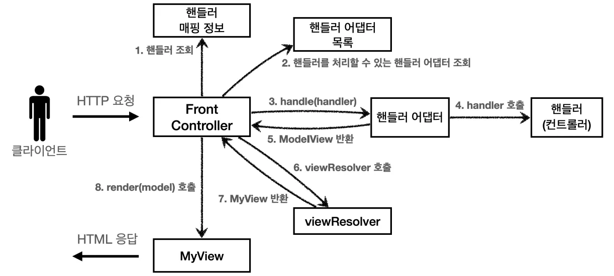
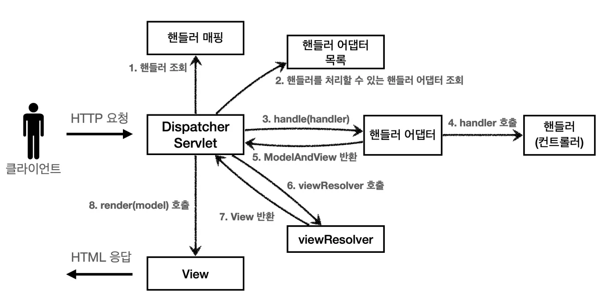

# 5. 스프링 MVC - 구조 이해

## 스프링 MVC 전체 구조

- 직접 만든 MVC 프레임워크와 스프링 MVC를 비교
    - 직접 만든 MVC 프레임워크 구조

      

    - SpringMVC 구조

      

- 스프링 MVC의 핵심 구성 요소는 무엇인가요?

  스프링 MVC는 우리가 직접 만든 MVC 프레임워크와 거의 같은 뼈대를 갖지만, 각 부분을 표준화된 컴포넌트로 나눠 놓았습니다.

    - 프론트 컨트롤러 역할을 하는 **DispatcherServlet**이 모든 요청을 받아들이고,
    - URL-컨트롤러 매핑을 담당하는 **HandlerMapping**,
    - 컨트롤러 호출 규격을 맞춰 주는 **HandlerAdapter**,
    - 컨트롤러 결과를 담는 **ModelAndView**,
    - 뷰 파일을 찾아 주는 **ViewResolver**,
    - 실제 화면을 그리는 **View** 가 차례로 협력합니다.
- DispatcherServlet 코드

    ```java
    protected void doDispatch(HttpServletRequest request, HttpServletResponse response) throws Exception {
        HttpServletRequest processedRequest = request;
        HandlerExecutionChain mappedHandler = null;
        ModelAndView mv = null;
    
        // 1. 핸들러 조회
        mappedHandler = getHandler(processedRequest);
        if (mappedHandler == null) {
            noHandlerFound(processedRequest, response);
            return;
        }
    
        // 2. 핸들러 어댑터 조회 - 핸들러를 처리할 수 있는 어댑터
        HandlerAdapter ha = getHandlerAdapter(mappedHandler.getHandler());
    
        // 3. 핸들러 어댑터 실행 -> 4. 핸들러 어댑터를 통해 핸들러 실행 -> 5. ModelAndView 반환
        mv = ha.handle(processedRequest, response, mappedHandler.getHandler());
    
        processDispatchResult(processedRequest, response, mappedHandler, mv, dispatchException);
    }
    
    private void processDispatchResult(HttpServletRequest request,
                                       HttpServletResponse response,
                                       HandlerExecutionChain mappedHandler,
                                       ModelAndView mv,
                                       Exception exception) throws Exception {
        // 뷰 렌더링 호출
        render(mv, request, response);
    }
    
    protected void render(ModelAndView mv,
                          HttpServletRequest request,
                          HttpServletResponse response) throws Exception {
        View view;
        String viewName = mv.getViewName();
    
        // 6. 뷰 리졸버를 통해서 뷰 찾기, 7. View 반환
        view = resolveViewName(viewName, mv.getModelInternal(), locale, request);
    
        // 8. 뷰 렌더링
        view.render(mv.getModelInternal(), request, response);
    }
    
    ```

- DispatcherServlet은 정확히 어떤 일을 하나요?
    - `DispatcherServlet`은 서블릿이면서 스프링 MVC의 프론트 컨트롤러입니다.
    - 스프링 부트가 애플리케이션을 띄울 때 이 서블릿을 모든 경로(`/`)에 자동 등록하고, HTTP 요청이 들어오면 부모 클래스인 `FrameworkServlet`-> `service()`-> `doDispatch()` 순으로 호출되어 본격적인 MVC 흐름을 시작합니다.
- 요청이 들어오면 내부적으로 어떤 순서로 처리되나요?
    1. 핸들러 조회: 핸들러 매핑을 통해 요청 URL에 매핑된 핸들러(컨트롤러)를 조회한다.
    2. 핸들러 어댑터 조회: 핸들러를 실행할 수 있는 핸들러 어댑터를 조회한다.
    3. 핸들러 어댑터 실행: 핸들러 어댑터를 실행한다.
    4. 핸들러 실행: 핸들러 어댑터가 실제 핸들러를 실행한다.
    5. ModelAndView 반환: 핸들러 어댑터는 핸들러가 반환하는 정보를 ModelAndView로 변환해서 반환한다.
    6. viewResolver 호출: 뷰 리졸버를 찾고 실행한다.
       JSP의 경우: InternalResourceViewResolver 가 자동 등록되고, 사용된다.
    7. View 반환: 뷰 리졸버는 뷰의 논리 이름을 물리 이름으로 바꾸고, 렌더링 역할을 담당하는 뷰 객체를 반환한다.
       JSP의 경우 InternalResourceView(JstlView) 를 반환하는데, 내부에 forward() 로직이 있다.
    8. 뷰 렌더링: 뷰를 통해서 뷰를 렌더링 한다

## 핸들러 매핑과 핸들러 어댑터

- 핸들러 매핑과 핸들러 어댑터는 무엇이고, 기본적으로 어떤 것들이 등록되나요?
    - 핸들러 매핑은 “요청 URL과 어떤 컨트롤러가 연결돼 있는가”를 찾는 전략 인터페이스이고, 핸들러 어댑터는 “찾아낸 컨트롤러를 어떻게 실행할 것인가”를 표준화한 인터페이스입니다.
- 스프링 부트가 자동 등록하는 핸들러 매핑과 핸들러 어댑터
  (실제로는 더 많지만, 중요한 부분 위주로 설명하기 위해 일부 생략)
    - HandlerMapping
        - 0 = RequestMappingHandlerMapping : 애노테이션 기반의 컨트롤러인 @RequestMapping에서 사용
        - 1 = BeanNameUrlHandlerMapping : 스프링 빈의 이름으로 핸들러를 찾는다.
    - HandlerAdapter
        - 0 = RequestMappingHandlerAdapter : 애노테이션 기반의 컨트롤러인 @RequestMapping에서 사용
        - 1 = HttpRequestHandlerAdapter : HttpRequestHandler 처리
        - 2 = SimpleControllerHandlerAdapter : Controller 인터페이스(애노테이션X, 과거에 사용) 처리
    - 핸들러 매핑도, 핸들러 어댑터도 모두 순서대로 찾고 만약 없으면 다음 순서로 넘어간다.
- @RequestMapping
    - 가장 우선순위가 높은 핸들러 매핑과 핸들러 어댑터는
      `RequestMappingHandlerMapping` ,
      `RequestMappingHandlerAdapter` 이다.
    - @RequestMapping 의 앞글자를 따서 만든 이름인데, 이것이 바로 지금 스프링에서 주로 사용하는 애노테이션 기반의
      컨트롤러를 지원하는 매핑과 어댑터이다.
    - 실무에서는 99.9% 이 방식의 컨트롤러를 사용한다

## 뷰 리졸버

- 뷰 리졸버는 뷰를 어떻게 결정하나요? 기본으로 무엇이 활성화되나요?
    - 컨트롤러가 반환한 논리 뷰 이름(예: `"new-form"`)을 받으면 뷰 리졸버 체인이 순서대로 실행됩니다.
    - JSP를 사용할 경우 `InternalResourceViewResolver`가 동작해서 `prefix + 논리이름 + suffix` 규칙(예: `/WEB-INF/views/new-form.jsp`)으로 실제 JSP를 찾고, `forward()`를 통해 렌더링합니다.
- 스프링 부트가 자동 등록하는 뷰 리졸버
  (실제로는 더 많지만, 중요한 부분 위주로 설명하기 위해 일부 생략)
    - 1 = BeanNameViewResolver : 빈 이름으로 뷰를 찾아서 반환한다. (예: 엑셀 파일 생성 기능에 사용)
    - 2 = InternalResourceViewResolver : JSP를 처리할 수 있는 뷰를 반환한다.

## 스프링 MVC

- 스프링이 제공하는 컨트롤러는 애노테이션 기반으로 동작해서, 매우 유연하고 실용적이다.
- 실무에서는 컨트롤러를 어떻게 작성하나요?
    - 대다수 프로젝트는 애노테이션 기반의 컨트롤러를 사용합니다.
    - 클래스에 `@Controller`를 붙이고, 메서드 단위로 `@RequestMapping` 또는 축약형 `@GetMapping`, `@PostMapping`을 선언해 URL-메서드-HTTP Method를 한눈에 매핑합니다.
    - 이렇게 하면 뷰 이름을 직접 문자열로 반환하고, `Model` 객체 파라미터에 데이터를 담아주는 간결한 코드를 쓸 수 있습니다.
- @RequestMapping에서 중복을 어떻게 제거할 수 있나요?
    - 클래스 레벨에 다음과 같이 @RequestMapping 을 두면 메서드 레벨과 조합이 된다.

    ```java
    @Controller
    @RequestMapping("/springmvc/v2/members")
    public class SpringMemberControllerV2 {}
    ```

    - 조합 결과
        - 클래스 레벨 @RequestMapping("/springmvc/v2/members"
            - 메서드 레벨 @RequestMapping("/new-form") → /springmvc/v2/members/new-form
            - 메서드 레벨 @RequestMapping("/save") → /springmvc/v2/members/save
            - 메서드 레벨 @RequestMapping → /springmvc/v2/members
- MVC 프레임워크 만들기에서 v3은 ModelView를 개발자가 직접 생성해서 반환했기 때문에, 불편했던 기억이 날 것이다. 물론 v4를 만들면서 실용적으로 개선한 기억도 날 것이다. 스프링 MVC는 개발자가 편리하게 개발할 수 있도록 수 많은 편의 기능을 제공한다.
    - Model 파라미터
        - save() , members() 를 보면 Model을 파라미터로 받는 것을 확인할 수 있다. 스프링 MVC도 이런 편의 기능을 제공한다.
    - ViewName 직접 반환

      뷰의 논리 이름을 반환할 수 있다.

    - @RequestParam 사용
        - @RequestParam은 어떤 상황에서 유용하게 쓰이나요? 버전업, 필터링, 페이징, 정렬
        - 스프링은 HTTP 요청 파라미터를 @RequestParam 으로 받을 수 있다.
        - @RequestParam("username") 은 request.getParameter("username") 와 거의 같은 코드라 생각하면 된다.
        - 물론 GET 쿼리 파라미터, POST Form 방식을 모두 지원한다
    - @RequestMapping → @GetMapping, @PostMapping
        - @RequestMapping 은 URL만 매칭하는 것이 아니라, HTTP Method도 함께 구분할 수 있다.
        - 예를 들어서 URL이 /new-form 이고, HTTP Method가 GET인 경우를 모두 만족하는 매핑을 하려면 다음과 같이
          처리하면 된다.
        - `@RequestMapping(value = "/new-form", method = RequestMethod.GET)`